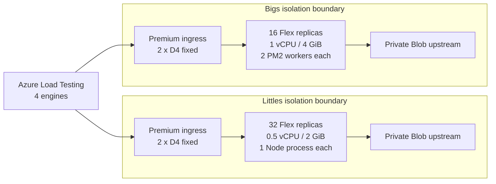

# Azure Container Apps: Bigs vs. Littles

An `azd`-deployable benchmark comparing two fixed-scale Node.js topologies on Azure Container Apps Flex with Premium ingress:

| Scenario | Replicas | Per replica | Node processes | Total allocation |
|---|---:|---:|---:|---:|
| Littles | 32 | 0.5 vCPU / 2 GiB | 1 | 16 vCPU / 64 GiB |
| Bigs | 16 | 1 vCPU / 4 GiB | 2 PM2 workers | 16 vCPU / 64 GiB |

## Benchmark outcomes

Both high-load tests used four Azure Load Testing engines, 500 users per engine (2,000 total), a 15-second ramp, fixed app replicas, and fixed Premium ingress capacity.

| Metric | Test 1: three 180-second pairs | Test 2: one 420-second pair |
|---|---:|---:|
| Littles requests | 6,560,617 | 5,120,553 |
| Bigs requests | 8,072,345 | 5,801,018 |
| Littles throughput | 12,149.29 RPS | 12,191.79 RPS |
| Bigs throughput | 14,948.79 RPS | 13,811.95 RPS |
| **Bigs throughput improvement** | **23.04%** | **13.29%** |
| Bigs mean latency reduction | 18.85% | 12.19% |
| Bigs p95 latency reduction | 39.80% | 28.52% |
| Bigs p99 latency reduction | 42.32% | 25.80% |
| **Bigs error-rate reduction** | **70.92%** | **66.37%** |

Across both tests, each scenario ran for 960 measured seconds:

| Combined outcome | Littles | Bigs | Bigs difference |
|---|---:|---:|---:|
| Requests | 11,681,170 | 13,873,363 | **+2,192,193** |
| Time-weighted throughput | 12,167.89 RPS | 14,451.42 RPS | **+18.77%** |
| Weighted error rate | 0.08494% | 0.02673% | **-68.53%** |

**Conclusion:** Bigs won all four high-load pairs. The 400-user warm-up was effectively tied, but at 2,000 users the larger replicas with two PM2 workers consistently delivered more throughput, lower latency, and fewer upstream timeout failures. Both scenarios retained their fixed replica counts with zero app restarts, and the load generators retained CPU headroom.

This result compares the complete **Bigs + PM2 topology** against **Littles**; it does not isolate PM2 as the sole cause. See [the full benchmark outcome](benchmark-outcome.md) for per-run data, confidence intervals, validity checks, and interpretation.

## Architecture



Each scenario receives its own Container Apps environment, VNet, delegated subnet, and private regional Blob Storage upstream. App replicas and Premium ingress nodes use equal minimum and maximum counts, so no autoscaling occurs during a run.

The same application source and `Containerfile` produce both images. `azd` passes `PROCESS_MODEL=single` or `PROCESS_MODEL=pm2`; PM2 cluster mode starts exactly two workers.

## Prerequisites

- An Azure subscription with permission to create resource groups, role assignments, networking, Container Apps, Storage, ACR, and Azure Load Testing resources.
- [Azure Developer CLI](https://learn.microsoft.com/azure/developer/azure-developer-cli/) 1.33.0 or later.
- Azure CLI and PowerShell 7 (`pwsh`).
- Available Container Apps Flex and D4 workload-profile quota in South Central US.

`azd` uses ACR remote builds, so Docker is optional for deployment. Docker is useful for local validation.

## Deploy

```powershell
azd auth login
az login
azd env new dev
azd env set AZURE_LOCATION southcentralus
azd up
```

`azd up`:

1. Provisions two isolated networks and Container Apps environments sequentially.
2. Creates Flex plus fixed two-node D4 Premium ingress profiles.
3. Creates ACR, managed identity, private Storage upstreams, and Azure Load Testing.
4. Uploads the upstream payload and stores short-lived read-only SAS URLs as Container Apps secrets.
5. Builds and deploys the single-process and PM2 image variants.
6. Smoke-tests both apps and registers the four-engine JMeter test definition.

It **does not run the benchmark**.

Provisioning two Premium-ingress Container Apps environments can take significant time. The environments are deliberately created sequentially because concurrent creation produced a stalled control-plane deployment during the recorded benchmark.

## Run the benchmark

Azure Load Testing runs are billable. The script requires an explicit confirmation switch:

```powershell
pwsh ./scripts/run-benchmark.ps1 -ConfirmBenchmarkRun
```

The default run performs:

- 60-second warm-ups at 100 users per engine.
- Three paired 180-second measurements at 500 users per engine.
- Four Azure Load Testing engines, or 2,000 concurrent users during measurement.

To repeat the extended five-million-request validation:

```powershell
pwsh ./scripts/run-benchmark.ps1 `
  -ConfirmBenchmarkRun `
  -SkipWarmup `
  -Repetitions 1 `
  -DurationSeconds 420 `
  -OutputPrefix extended-benchmark-runs
```

Generated run summaries are written to the ignored `artifacts/` directory without portal URLs, subscription IDs, SAS URLs, or machine-local paths.

## Simulation app

For every `GET /work` request, the app:

1. Fetches a small object from its scenario-specific private Blob endpoint.
2. Consumes the upstream response.
3. Asynchronously waits 40 ms.
4. Returns `200 OK`, or `502` when the upstream request fails or times out.

Other routes are `/health`, `/ready`, `/config`, and `/stats`. `/config` and startup logs redact the SAS query string.

Run locally:

```powershell
npm ci --prefix ./app
npm test --prefix ./app

docker build -f ./app/Containerfile --build-arg PROCESS_MODEL=single -t aca-lvb:single ./app
docker build -f ./app/Containerfile --build-arg PROCESS_MODEL=pm2 -t aca-lvb:pm2 ./app
```

## Important constraints

- Flex rejected the originally proposed 0.5 vCPU / 1 GiB and 1 vCPU / 2 GiB combinations. The benchmark preserves CPU and replica counts with Flex-compatible 1:4 CPU-to-memory sizing.
- Premium ingress requires at least two dedicated workload-profile nodes; both environments pin the D4 ingress profile to exactly two nodes.
- Anonymous Blob access may be blocked by policy. This template keeps blobs private and configures read-only SAS secrets after provisioning.
- Re-running `azd provision` refreshes the upstream SAS tokens and restores the last deployed application images before returning.
- At publication time, `npm audit` reported high-severity advisories in PM2's unused file-watching dependency chain. Watch mode and user-controlled glob input are not enabled; review the advisory status before adapting this sample for production.

## Cost and cleanup

This deployment intentionally keeps **48 app replicas**, **four D4 Premium ingress nodes**, two Container Apps environments, and supporting services active. Azure Load Testing adds run-time charges when benchmarks execute.

Resources are never deleted automatically. When you explicitly want to remove the selected `azd` environment:

```powershell
azd down
```

Review the selected environment and resource group before confirming cleanup.

## Repository layout

| Path | Purpose |
|---|---|
| `app/` | Node simulation app, PM2 config, tests, and dual-mode container build |
| `infra/` | Subscription-scope `azd` Bicep entry point and resource modules |
| `load-tests/` | Environment-driven JMeter test plan |
| `scripts/` | Upstream setup, test registration, deployment wrapper, and benchmark runner |
| `results/2026-10-06/` | Sanitized results from the recorded benchmark |
| `benchmark-outcome.md` | Methodology, analysis, validity checks, and conclusion |
